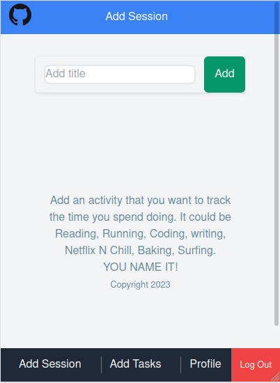
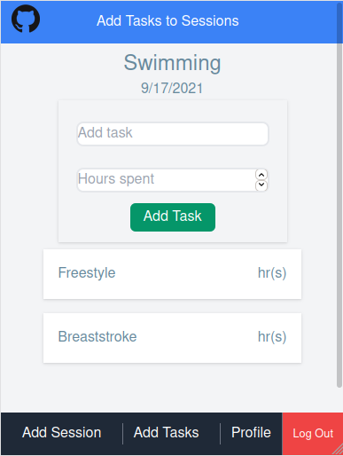
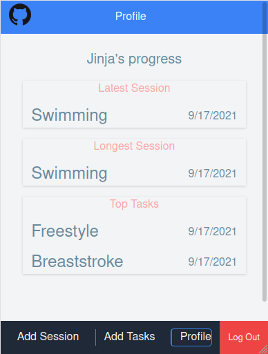

# Tracking App

> This project was bootstrapped with [Create React App](https://github.com/facebook/create-react-app), along with the redux template.

## About The Project

> In this project, I developed a frontend web application (tracking app), used to track time spent on any given task for a given activity.
> This is the frontend app that connects to the [Backend app](https://github.com/mke2111/tracking-app-api) hosted on Heroku

## Screenshots

<div align='center' class='d-flex'>
  <span align="">
    
    
    
  </span>
</div>

The application features includes:

- Create new activities/sessions.
- Create new tasks and allocate the time spent on the task.
- Track a users perfomance based on their sessions ans tasks.
- Show the user their latest and longest activities.

## Live Version

[Tracking App](https://mke2111-1.netlify.app)

### Built With

This project was built using these technologies.

- JavaScript
- React/Redux
- HTML/CSS3
- TailwindCSS
- Netlify ( For deployment)

## Installation

> Make sure Node.js is running on your local machine

To use this app locally, this is what you need to:

- [Download](https://github.com/mke2111/tracking-app.git) or clone this repo:

  - Clone with HTTPS in the terminal.

  ```
    git clone https://github.com/mke2111/tracking-app.git

  ```

- Then `cd tracking-app` into the downloaded folder and run `npm install` or `yarn install`
- then, run `npm run start` or `yarn start`

- Test the app with `yarn test --watchAll`

## Author

👤 **Roy Mukuye**

- GitHub: [@mke2111](https://github.com/mke2111)
- Twitter: [@Roymkenya](https://twitter.com/Roymkenya)
- LinkedIn: [Roy Mukuye](https://www.linkedin.com/in/roy-mukuye-42b07b1b4)

## Acknowledgements

Design idea by [Gregoire Vella on Behance](https://www.behance.net/gregoirevella) - [Bodytrack.it - An iOs app - Branding, UX and UI](https://www.behance.net/gallery/13271423/Bodytrackit-An-iOs-app-Branding-UX-and-UI)

## 📝 License

This project is [MIT](https://opensource.org/licenses/MIT) licensed.
